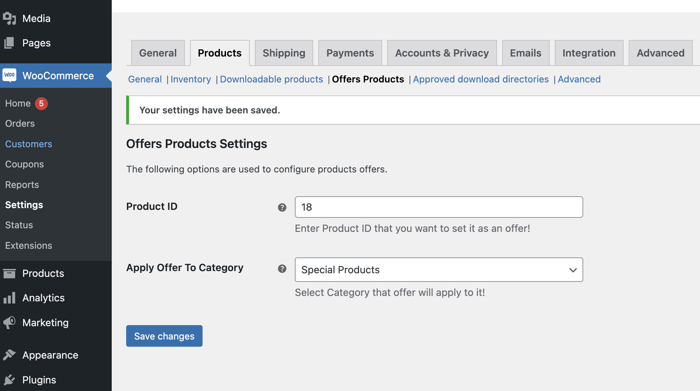

## ANCHOVY ∪ NIU = { 9H }

#### Custom wordpress plugin to add woocommerce offers/gifts for specific products' categories.

[README Version 1](README_v1.md) 
README Version 2 [current]

### TODOs:
- [ ] This is POC, some corner test cases not handled such as change offer product id, or eligible category id of the offer while there are some carts with old offer products..
- [ ] Populate products in the select menu of offer product wc config and add validations for incorrect inputs
- [ ] Validate preventing adding single offer product via [backend] e.g. curl or api call
- [ ] Improve add&remove item to cart logic (regarding update offers items)
- [ ] Cover translations 

V1 Demo video:

https://github.com/khaledalam/wordpress-woocommerce-offer-plugin/assets/8682067/5f512a57-bc91-4191-9704-079c2753c0b6

DB dump: [wordpress_v2.sql](./wordpress_v2.sql)

Test cases: [test_cases](./test_cases)

---

### Problem/requirements
- Ability to auto-add offer products(gifts) to wordpress woocommerce cart when user try to add any products from specific categories.
- Ability to set the allowed categories <-> gifts from admin dashboard.
- Restrict cart CRUD operations for this kind of "offer" products.

---
### Example

- 3 t-shirt products => belongs to [Special Category] => add gift product(Clothes Hanger) for each item.
- 2 short products => belongs to [Uncategorized] => add no gifts.

 

----------------------------------------------------------------
### Approach/solution/technical
- Create custom woocommerce product settings section "Offers Products" that will allow the admin & shop manager to manage/set categories <-> gifts association in the dashboard.
- Use filters/actions hooks:
  - <b>Actions</b>:
    - carbon_fields_register_fields
    - after_setup_theme
    - woocommerce_add_cart_item_data
    - woocommerce_update_cart_action_cart_updated
    - woocommerce_remove_cart_item
    - wp
  - <b>Filters</b>:
    - woocommerce_get_sections_products 
    - woocommerce_get_settings_products
    - woocommerce_cart_item_remove_link
    - woocommerce_cart_item_quantity
- No hard-coded
- "Offer" product marking depends set product id in  woocommerce product settings section "Offers Products"
- Relation between product's category<->"offer" product depends on wc options `product_offer_cat_term_id` and `product_offer_id`.

---
### Auth:
admin: 
user: 9Huser 
pass: 9Hpassword9H  
shop manager: 
user: 9hshopmanager 
pass: shopmanager9H

PMA: 
user: root 
pass: password 

> $ docker-compose up -d --build

---
#### References
- [wordpress-docker-compose](https://github.com/kassambara/wordpress-docker-compose) used as template.
- [wppb](https://wppb.me/) used as plugin template.
